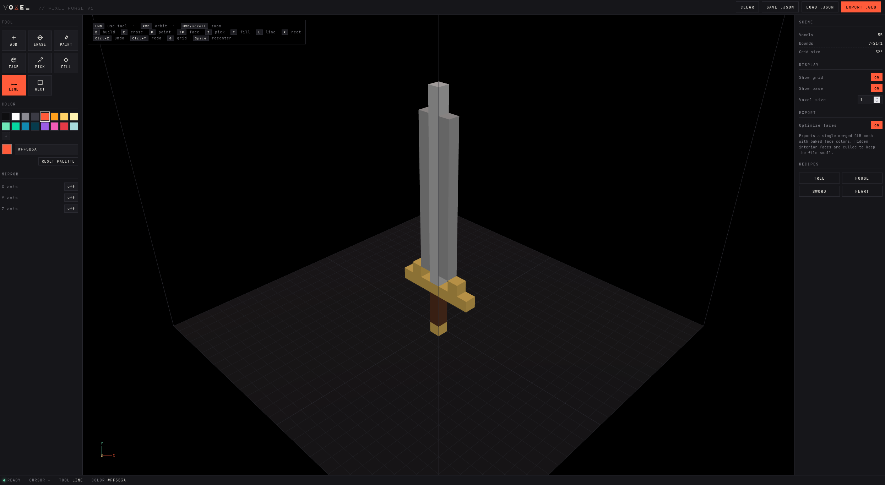

# VOXEL // pixel forge

Use it now: [https://voxelpixelforge.github.io/](https://voxelpixelforge.github.io/)

VOXEL // pixel forge is a lightweight voxel editor for building colorful block models directly in your browser.

## Features

- Fast voxel tools: add, erase, paint, line, rect, fill, and face paint.
- Mirror editing on X/Y/Z axes for quick symmetric builds.
- Undo/redo, grid controls, and camera shortcuts for smooth editing.
- Export optimized `.glb` meshes with baked face colors.
- Save and load projects as `.json`.

## Why use it

- Completely local: your work stays on your machine.
- Works in your browser, no need to download and install yet another app.
- Free to use.
- Open source.

## AI Disclosure

The code for Voxel Pixel Forge is completely AI generated.
